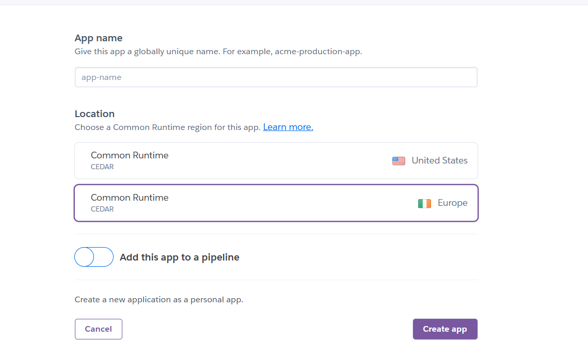

# Deployment

The app was deployed to [Heroku](https://heroku.com). You can create an account with the link in order to continue with deployment, or you can deploy locally.

## Local Deployment

Start by typing 'git clone https://github.com/AlistairDriscoll/Ally-Ps-Luxury-Teas-Leeds.git'

Then create a virtual environment with this command into your powershell: 'python -m venv .venv'

Once you have done that, you will need to activate it: '.\.venv\Scripts\Activate'

Once this is going, install your dependencies with 'pip install -r requirements.txt'

Now type 'touch env.py' to create the file.

### What You Will Need

You will need a Django secret key. [this](https://djecrety.ir/) website worked fine for me.

The database was deployed to Code Institute Postgres Database server, provided to me by The Code Institute who I am studying with currently. This project will be my Project 5 submission in their 'Diploma in Full Stack Development' course. One can look online for other database storage resources if not on this course. In order to deploy you will need to find one and get its URL.

For taking payment I used [Stripe](https://stripe.com). You will need to click on the link and create an account. You will need to get the public and secret keys.

In order to use media files for this app, I also used , although other services can be used also such as Amazon S3. Once you have made a Coudinary account make sure you can get its cloud name, API key and API secret.

Once you have your variables, set them up in the env.py file like so:

Add the following lines to ```env.py```:

    - ```import os```
    - ```os.environ["SECRET_KEY"]``` = <your secret key>
    - ```os.environ["DEVELOPMENT"]``` = <True or False depending on whether you are in development or not>
    - ```os.environ["ALLOWED_HOSTS"]``` = <your domain name>
    - ```os.environ["DATABASE_URL"]``` = <your database url>
    - ```os.environ["CLOUDINARY_CLOUD_NAME"]``` = <your cloudinary cloud name>
    - ```os.environ["CLOUDINARY_API_KEY"]``` = <your cloudinary api key>
    - ```os.environ["CLOUDINARY_API_SECRET"]``` = <your cloudinary api secret>
    - ```os.environ["CLOUDINARY_URL"]``` = <your cloudinary URL (Cloudinary explains how to find this out on their website)>
    - ```os.environ["STRIPE_PUBLIC_KEY"]``` = <your stripe public key>
    - ```os.environ["STRIPE_SECRET_KEY"]``` = <your stripe secret key>

Once these are all filled in you can migrate with:

- ```python manage.py makemigrations```
- ```python manage.py migrate```

- After migration, you will need to create a superuser.


Then create the superuser.

    - ```python manage.py createsuperuser```

and follow the instructions to make one.

Note: This is how one deploys when using VSCode. *If you are using Gitpod, you can skip steps 1-3 by clicking this [link](https://gitpod.io/#https://github.com/AlistairDriscoll/Ally-Ps-Luxury-Teas-Leeds.git), and not worry about the venv stuff.*

## Deployment to Heroku

Create your Heroku app once you have made your account and choose your location depending on if you are in Europe or USA.




Once the app is created, you will need to go to the settings by pressing the button in the page header, then scroll down to 'reveal config vars.' You will then be presented with the option to add 'key' and 'value' pairs.

[Settings button](documentation/deployment/settings-btn.png)
[Config Vars](documentation/deployment/config-vars.png)

Set up the same key value pairs as stated in the local deployment section here.

Once you have inputted everything, go to the deploy tab back at the same header with the settings.

Choose github as your deployment method:


If you haven't already you will need to connect your Github and Heroku accounts in the terminal:

1) ```heroku login -i``` then fill out the instructions
2) ```heroku git:remote -a <your-heroku-app-name>```

Now create a Procfile in your root directory.