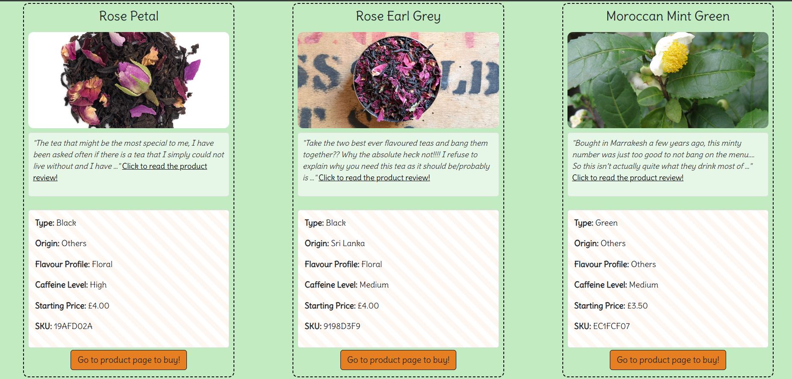
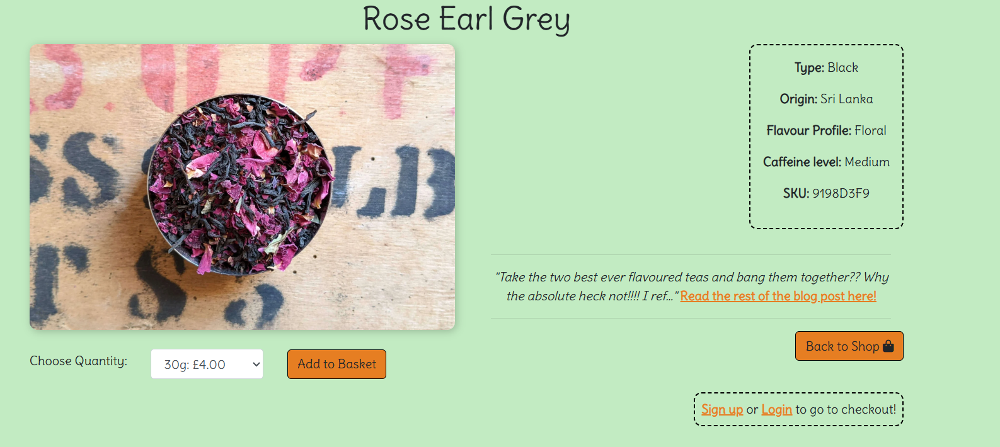
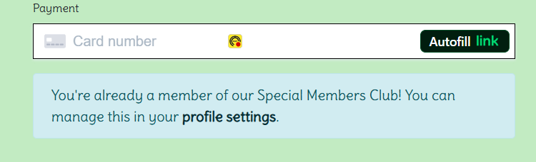
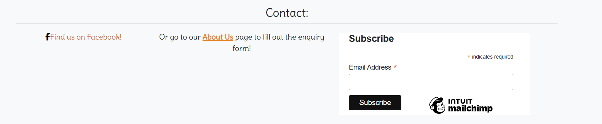
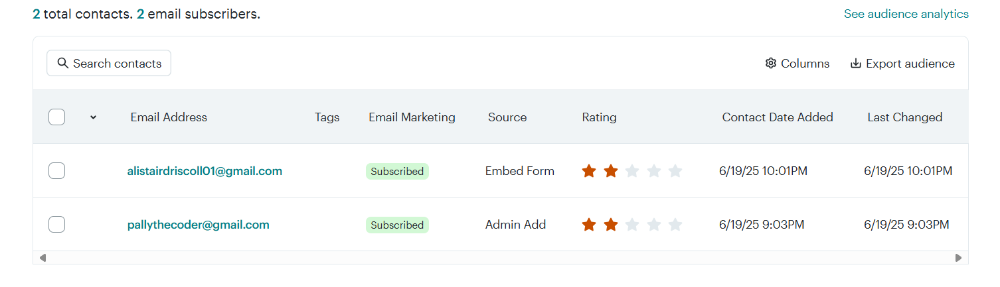

# FEATURES

This document outlines the key features of the Luxury Teas e-commerce site, built using Django, Stripe, and Bootstrap.

---

## General

- Fully responsive design using Bootstrap 5
- Clear, consistent navigation bar:
  - Shop, Bag, Account links
  - Toasts appear to confirm user actions (e.g. login, logout, add to bag)
- Custom 404 error page
- Footer with social links and newsletter prompt

---

## Color Scheme

In going for a luxury tea company I did realise that a certain theme had to be made. Light pastel colours were used to make my website easy on the eye.

| Colour Description             | Value                        | Swatch |
|-------------------------------|------------------------------|--------|
| Primary Accent Orange         | `#f78e1e`                    | 

 |
| Sample Hover Orange           | `#e47c00`                    | 

 |
| Button Orange (Secondary)     | `#e67e22`                    | 

 |
| Text Accent Orange            | `rgba(205, 102, 51, 1)`      | 

 |
| Soft Green Background         | `rgba(102, 205, 102, 0.4)`   | 

 |
| Stripe Base                   | `#ffffff`                    | 

 |
| Stripe Alt                    | `#fef7f1`                    | 

 |
| Link Hover Blue               | `#0056b3`                    | 

 |
| General Black (text/borders) | `black`                      | 

 |
| Scrollbar Grey                | `#aaa`                       | 

 |

## Products and Shopping

- View all available loose-leaf teas with images, weights, and prices
- Product weights include: 30g, 100g, and 300g (prices scale accordingly)
- Add multiple items to the bag, with selected weights and quantities
- Edit weights and quantities directly in the bag
- Remove individual items
- Total and subtotal dynamically calculated
- Bag displays both regular teas and free samples (if added)

---

## Free Sample Logic

- If the user has not added all teas to their bag:
  - Up to 3 × 5g samples of missing teas are offered
- If the user has already added every tea:
  - A 20g sample of “Breakfast Blend” is offered instead
- Sample options are clearly shown in the bag
- Clicking a sample option adds it to the bag

---

## Checkout

- Secure Stripe integration for payments
- Users complete delivery details via a form
- Logged-in users can save delivery information to their profile
- Optional newsletter subscription checkbox appears at checkout (only if user is not already subscribed)
- On successful payment:
  - User is redirected to a confirmation page
  - Bag is cleared
  - Order is saved and visible in user’s profile

---

## User Accounts

- Register, log in, and log out using Django Allauth
- Navbar changes dynamically based on login status
- Profile page includes:
  - View/edit delivery details
  - View order history
  - Manage newsletter subscription
- Form is pre-filled with saved delivery info
- Access to “My Account” and profile management pages

---

## Newsletter Subscription

#### Email subscription

I was first encouraged by my course to include an email marketing embedment from Mailchimp, but as a user can only buy from my website when they are signed up I deemed this at first not the right way to handle email marketing. I then made my own 'subscribed_to_email' variable in my UserProfile model and included my own HTML for this, but after encouragement from a tutor decided to also include a mailchimp newsletter subscription form. Instead of deleting my old functionality though I then turned it into a 'members_club' subscription where members with an account already can subscribe to get early offers on new teas amongst other perks (an idea I actually adopted from another tea company who invited me to do the same after I bought enough of their tea!)

Here is an example of the HTML showing when the user has subscribed already
 Then here is the footer including an email marketing form that both users and non users can subscribe to.

Here is a list of email subscribers that mailchimp store for you.
---

## Blog (Superuser-Only Feature)

- Superusers can create, update, and delete blog posts
- Blog post list is shown on a dedicated admin panel
- Posts can be managed via buttons linked to the superuser dashboard

---

## Admin / Superuser Features

- Dedicated admin dashboard (/superuser/)
- View all orders from all users
- View and manage user enquiries
- Manage blog posts (CRUD)
- Regular users are denied access to this area

---

## Additional Features

- Responsive on all screen sizes (mobile, tablet, desktop)
- Validated HTML, CSS, JS and Python (W3C, JSHint, flake8)
- Fully documented testing and features
- Screenshot evidence provided in testing folder
