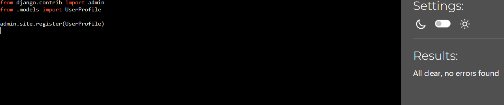

# Validation

## Python

I used black formatter whilst using this project and then the code institute python linting website. The empty bit to the side of the code indicates a lack of any problems with the linter.

### About App

### Ally P's Luxury Tea's Project

### Bag App

### BrewsReviews App

### Checkout App

### Profiles App

### Shop App

### Superuser App

### Welcome

## HTML

I used the w3 HTML linter for all my HTML pages, displayed below.

